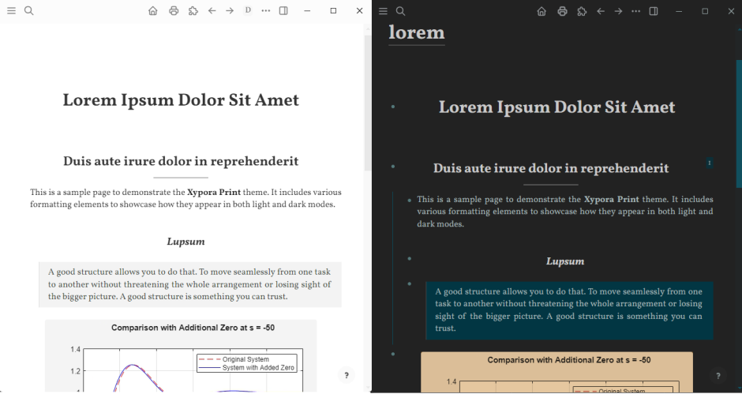

# Xypora Print Theme for Logseq

A print-friendly, academic, and paper-like theme for Logseq, inspired by the clean aesthetic of Typora. This theme is designed with a dual-mode approach, offering a unique experience for both light and dark modes.

## Features

### 1. Distraction-Free Light Mode

The light mode is crafted to be a clean, paper-like writing and reading environment. It's perfect for focusing on your content and for creating beautiful, print-friendly exports.

* **Minimal UI**: Light-mode Intentionally hides UI elements like the page hierarchy, page title, and block breadcrumbs to reduce clutter.
* **Quick Restore**: Need the UI elements back? Simply switch to dark mode with the `t t` shortcut to instantly restore the standard interface.

### 2. Seamless Page Embeds

When in **Document Mode** (`t d`), embedded pages blend directly into the main document, removing the default indentation and secondary-color styling. This creates a flat, continuous text flow, ideal for composing long-form documents from disprate pages.

### 3. Dark Mode Image Filter

To reduce eye strain during late-night sessions, the dark mode applies a subtle, warm orange filter over images. This helps to cut down on blue light, making for a more comfortable viewing experience, especially when looking at bright white figures or diagrams.

### 4. Print-Friendly Page Breaks

* **Insert Page Breaks**: When you're preparing a document for printing, you can insert a page break by simply creating a block with a horizontal rule (`---`). When printed, this will force the content that follows to start on a new page.
* **Page Break Visualization**: The theme now includes estimated pagebreak visualizations, (outside of document mode) allowing you to see and plan your page breaks intelligently before printing.

### 5. Elegant Excalidraw Printing

Embedded Excalidraw diagrams now print elegantly, with their user interface elements automatically hidden in the final export.

### 6. Figure Captions

`h6` headings are now styled to serve as clean, professional-looking captions for your figures and images.

`###### Figure 1: A diagram`

## Installation

The easiest way to install Xypora Print is from the Logseq Marketplace.

1.  Navigate to `...` > `Plugins` (or `Settings` > `Plugins` on Desktop).
2.  Go to the `Marketplace` tab.
3.  Click the `Themes` tab.
4.  Search for `Xypora Print` and click `Install`.

## Usage with the "PDF Print" Plugin

This theme is designed to work seamlessly with the logseq-pdf-export plugin. For the best results, follow these steps:

1.  **Enable Light Mode**: Switch to the theme's light mode for a clean, paper-like background.
2.  **Enable Wide Mode**: Use the `t w` shortcut.
3.  **Close the Sidebars**: Collapse both the left and right sidebars.
4.  **Add Manual Pagebreaks** (Optional) use the dotted-line pagebreak estimators to insert manual pagebreaks in logical places.
5.  **Enable Document Mode**: Use the `t d` shortcut. (this will also hide the pagebreak indcators)
8.  **Review & Scroll to the Bottom**: Scroll all the way down the page to ensure all content (especially images) is loaded into memory. This prevents truncated exports.
9.  **Run the Plugin**: Use the "Export to PDF" command from the command palette.

> **Note:** The PDF Print plugin can be slow, especially with large pages. Please be patient and **wait 2-3 minutes** after pressing "print" to allow the pdf to be fully written; otherwise it will appear as 0 bytes.

**Known Issue & Call for Help:** A common bug with Logseq's PDF export plugins is the generation of trailing blank pages. This appears to be an upstream issue that cannot be corrected by the theme's CSS. If you are a developer with a CSS-based solution or the ability to help improve the export plugins directly, your contributions would be greatly valued by the community.

## Credits

Developed by **Xyvir**.

